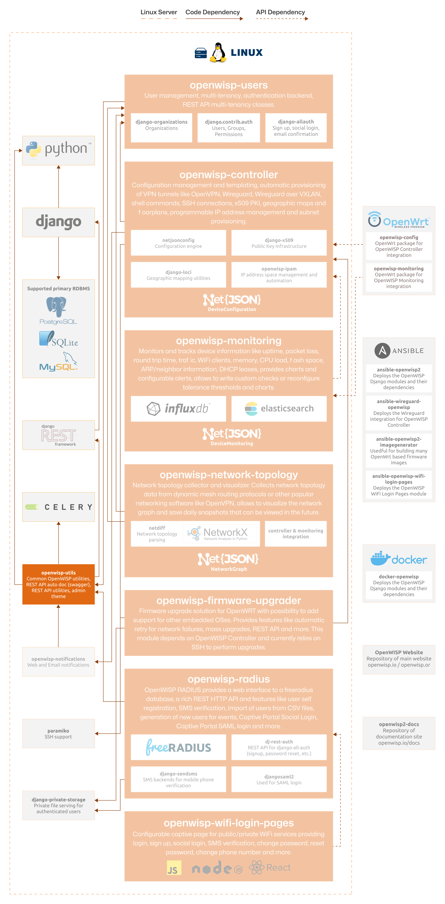

Utils
=====

.. seealso::

    **Source code**: `github.com/openwisp/openwisp-utils
    <https://github.com/openwisp/openwisp-utils>`_.

The goal of OpenWISP Utils is to minimize duplication, ease maintenance,
and enable the rapid development of new OpenWISP modules by leveraging
battle-tested best practices.

This is achieved by providing code structures that are inherited,
extended, and utilized across different modules in the OpenWISP ecosystem.

The following diagram illustrates the role of the Utils module within the
OpenWISP architecture.

    **OpenWISP Architecture: highlighted utils module**

.. important::

    For an enhanced viewing experience, open the image above in a new
    browser tab.

    Refer to :doc:`/general/architecture` for more information.

.. toctree::
    :caption: Utils Usage Docs
    :maxdepth: 1

    ./user/metric-collection.rst
    ./user/admin-filters.rst
    ./user/settings.rst

.. toctree::
    :caption: Utils Developer Docs
    :maxdepth: 2

    Developer Docs Index <developer/index.rst>
